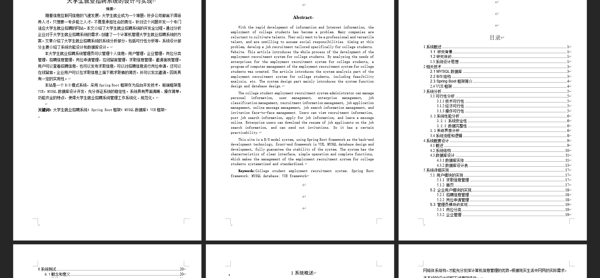
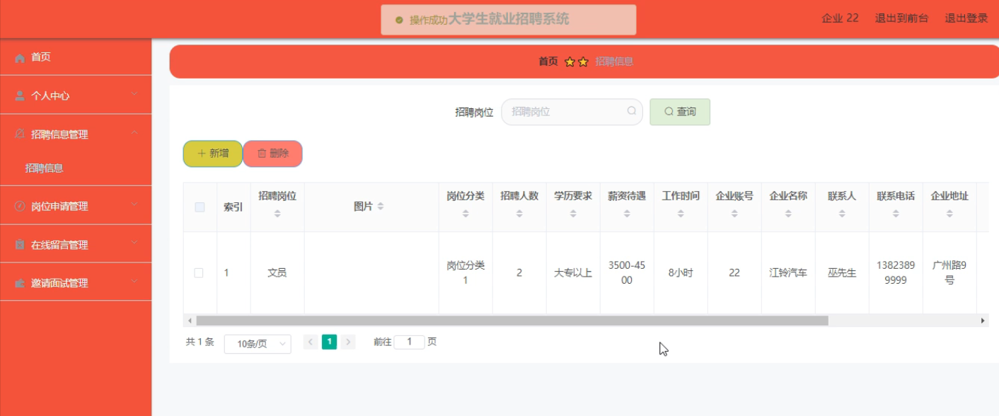
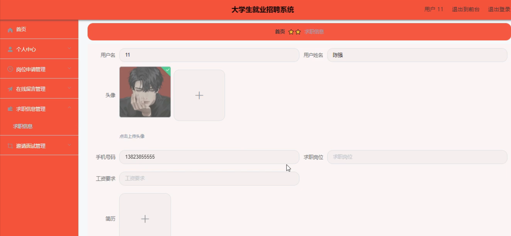
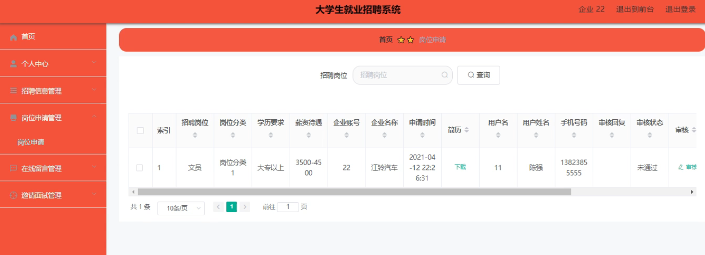
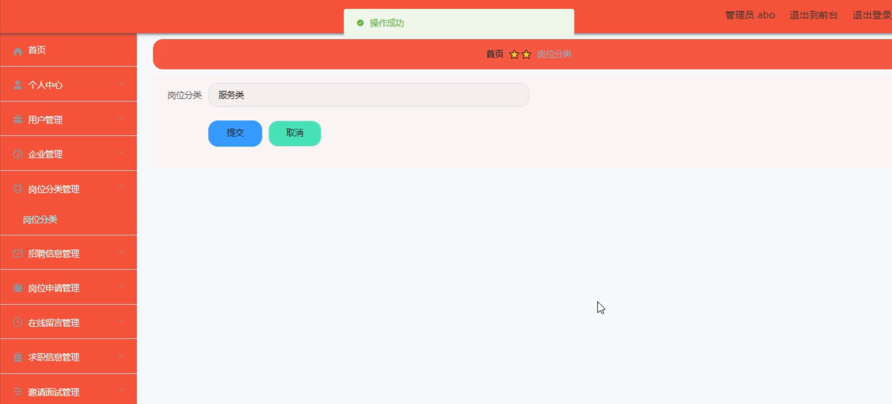
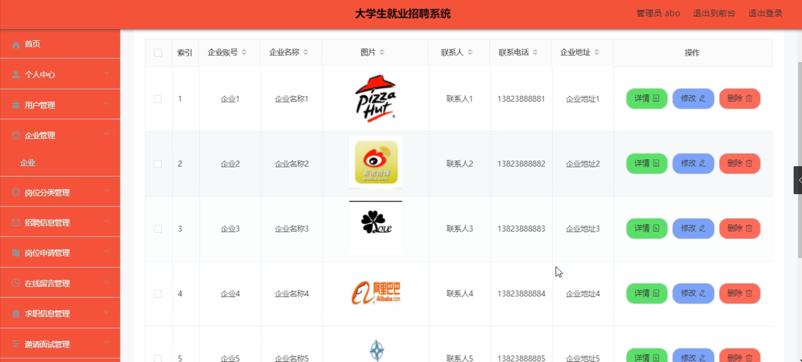

基于SpringBoot的大学生就业招聘系统（程序+论文）
=
- 完整代码获取地址：从戎源码网 ([https://armycodes.com/](https://armycodes.com/))
- 作者微信：19941326836  QQ：952045282 
- 承接计算机毕业设计、Java毕业设计、Python毕业设计、深度学习、机器学习
- 选题+开题报告+任务书+程序定制+安装调试+论文+答辩ppt 一条龙服务
- 所有选题地址https://github.com/nature924/allProject

一、项目介绍
---
系统包含两种角色：用户、管理员，系统分为前台和后台两大模块，主要功能如下：

### 1 用户模块的实现

- 求职信息管理: 用户可以管理自己的求职信息，包括添加、修改和删除求职信息。

- 首页: 用户登录后可以在首页查看招聘信息和求职信息展示。

### 2 企业用户模块的实现

- 招聘信息管理: 企业用户可以新增招聘信息，并对其进行修改和删除操作。

- 岗位申请管理: 企业用户可以查看其他用户的岗位申请，并对这些申请进行审核。

### 3 管理员模块的实现

- 岗位分类管理: 管理员可以对岗位分类进行添加、修改、查询和删除操作。

- 企业管理: 管理员可以对企业信息进行查询和删除操作。

二、项目技术
---
- 编程语言：Java
- 数据库：MySQL
- 项目管理工具：Maven
- 前端技术：VUE、HTML、Jquery、Bootstrap
- 后端技术：Spring、SpringMVC、MyBatis

三、运行环境
---
- 操作系统：Windows、macOS都可以
- JDK版本：JDK1.8以上都可以
- 开发工具：IDEA、Ecplise、Myecplise都可以
- 数据库: MySQL5.7以上都可以
- Tomcat：任意版本都可以
- Maven：任意版本都可以

四、运行截图
---
### 论文截图：

### 程序截图：

